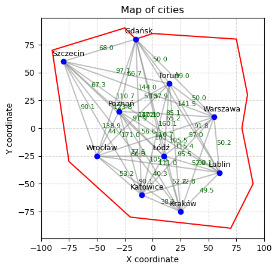
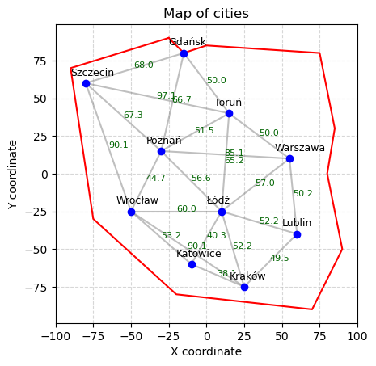
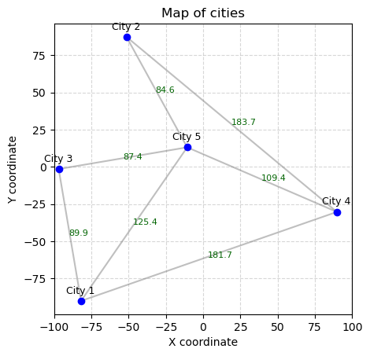
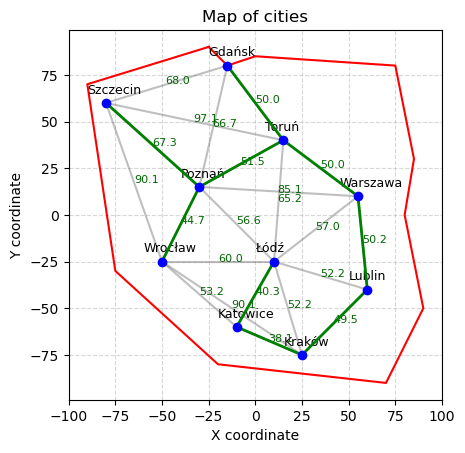
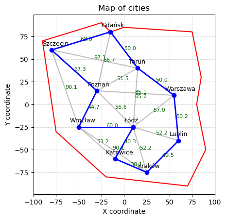
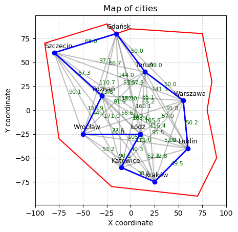
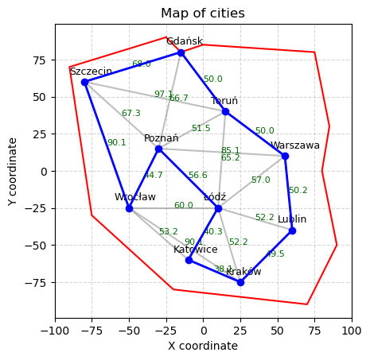
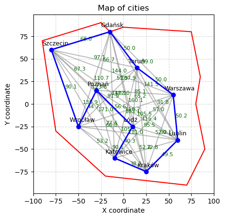
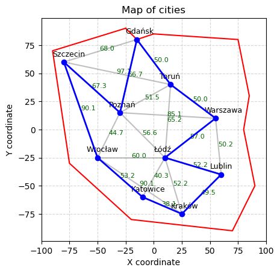
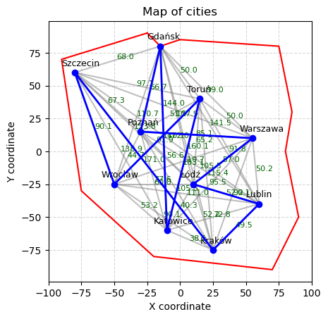

# Route searching

The small project was based on travelling salesman problem to optimize finding the fastest way to visit all cities once and then go back to the initial city. 
My implementation includes BFS (Breadth-First-Search), DFS (Depth-First-Search), MST (Minimum spanning tree) and gready approach algorithms based on the three different scenarios:
- (a) Where all cities are directly connected with each other - there is no city with no connection to the others.

- (b) Where i've created custom connections between cities

- *(c) Where cities are generated randomly as well as their connections

## Requirements

- numpy
- matplotlib
- math
- collections.defaultdict
- collections.deque

## Results

In the summary I'll just consider first two schemas, because of their non-randomness, they'll be more reliable.

The best algorithm based on the shortest total distance in the both first scenario, where all cities all connected with each other, and the second scenario, where I've created custom connections, was MST algorithm with total distance of 441.6km, but however this didn't satisfied the goal of salesmans problem, because we haven't found the way back to the initial city.

The best algorithm (which satisfied the travelling salesman problem) there was BFS with total distance of 518.1km

The second place has achived Gready search with 537km

and the third place has achived DFS algorithm with 574km in the second scenario and 906.82km in the first scenario.

## Conclusions

DFS performance can be a little bad because of my implementation, I implemented that the DFS function returns the first way which satisfies the salesman problem of visiting all cities once and going back to the initial city.